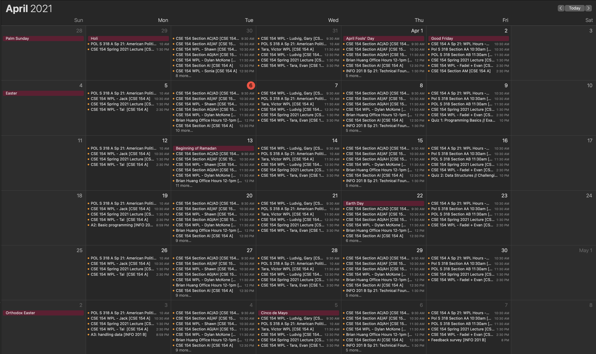

# Chapter 4

Exercises for [chapter 4](https://faculty.washington.edu/otoomet/info201-book/git-basics.html)

* Ex 1: git basics: set up git, fork-clone-edit readme-commit-push
* Ex 2: add files (image)
* Ex 3: play with branches

### What I ate for Breakfast
1. Coffee
2. Adderall

This is my calendar in gmail, into which I import my UW calendar.  Because the administrators are too lazy to assign students to **only** their assigned sections, my calendar has now become useless, as you can see.